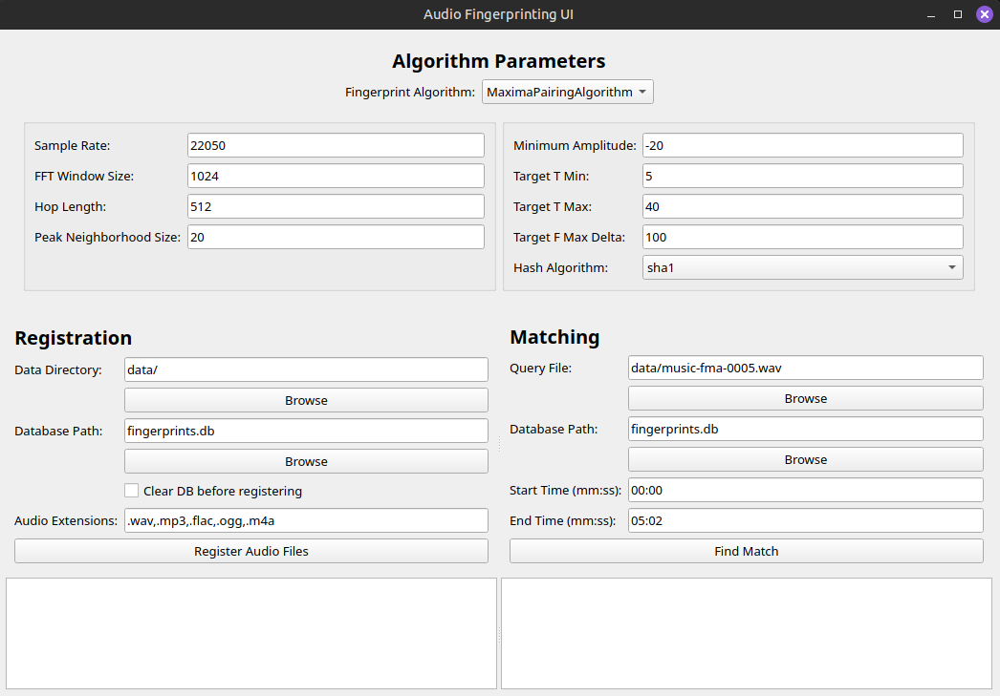

# Audio Recognition App



This project implements and experiments with several ways to do audio recognition. It includes implementations of three algorithms, an SQLite database to store fingerprints, and a GUI built with PyQt5.


<details>
<summary>Click to Expand: Table of Contents</summary>

- [Features](#features)
- [Requirements](#requirements)
- [Installation](#installation)
- [Usage](#usage)
  - [Graphical User Interface (GUI)](#graphical-user-interface-gui)
  - [Testing Script](#testing-script)
- [Algorithms](#algorithms)
  - [1. Maxima Pairing Algorithm](#1-maxima-pairing-algorithm-maxima_pairing_algorithmpy)
  - [2. Spectral Patch Algorithm](#2-spectral-patch-algorithm-spectral_patch_algorithmpy)
  - [3. Chroma Algorithm](#3-chroma-algorithm-chroma_algorithmpy)
  - [Algorithm Performance](#algorithm-performance)
- [Database Schema](#database-schema-sqlite_dbpy)
- [License](#license)
</details>


## Features

- **Fingerprinting Algorithms:** Implements three distinct algorithms to audio fingerprinting (see [Algorithms](#algorithms) for more detail):
    - Maxima Pairing Algorithm
    - Spectral Patch Algorithm
    - Chroma Algorithm
- **Database Storage:** Uses SQLite to store audio file metadata and generated fingerprints for efficient lookup.
- **Graphical User Interface:** Provides an interface using PyQt5.
- **Segment Matching:** Allows matching specific segments of a query audio file using start and end times.
- **Testing:** Includes a test script (`tests.py`) to evaluate algorithm performance by registering a dataset and attempting to match each file.
- **Data:** The `data/` directory contains a sample of several song the [MUSAN](https://paperswithcode.com/dataset/musan) dataset

## Requirements

- Python 3 (version 3.12.9 was used during development)
- NumPy: `pip install numpy`
- Librosa: `pip install librosa`
- PyQt5: `pip install PyQt5`


## Installation

1.  **Clone the repository:**
    ```bash
    git clone <https://github.com/bmazou/audio-recognition>
    cd <audio-recognition>
    ```
2.  **Create and activate a virtual environment (optional):**
    ```bash
    python -m venv venv
    source venv/bin/activate # On Linux/MacOS
    venv\Scripts\activate    # On Windows
    ```

3.  **Install the required packages:**
    ```bash
    pip install -r requirements.txt
    ```

## Usage

<details>
<summary>Click to expand: Detailed description</summary>

### Graphical User Interface

The primary way to interact with the app is through the GUI.

1.  **Run the application:**
    ```bash
    python app_gui.py
    ```
2.  **Configure Algorithm:**
    - Select the desired fingerprinting algorithm from the dropdown menu.
    - Adjust the parameters for the selected algorithm in the "Algorithm Parameters" section. Default values are provided.
3.  **Register Audio Files:**
    - In the "Registration" section, specify the directory containing your audio files (`Data Directory`).
    - Specify the path for the SQLite database file (`Database Path`). A new file will be created if it doesn't exist.
    - Optionally, check "Clear DB before registering" to remove all existing fingerprints before adding new ones (it removes everything, so use with caution).
    - Click "Register Audio Files". The process will run in the background, and logs will appear in the bottom-left text area. Files already present in the DB (for the selected algorithm) will be skipped unless the DB is cleared.
4.  **Match an Audio File:**
    - In the "Matching" section, select the `Query File` you want to identify.
    - Specify the `Database Path` containing the fingerprints to search against.
    - Optionally, provide `Start Time` and `End Time` (in `mm:ss` format) to identify only a segment of the query file. Leave `End Time` blank to match until the end.
    - Make sure the "Algorithm Parameters" are identical to the ones used during registration.
    - Click "Find Match". The matching process runs in the background, and results/logs appear in the bottom-right text area.

### Testing Script

The `tests.py` script provides a way to test the accuracy of the algorithms on a dataset.

1.  **Prepare Data:** Place the audio files you want to use for testing inside a directory named `data` (or modify the `data_dir` variable in `tests.py`).
2.  **Configure Test:** Open `tests.py` and modify the `main()` function to select which algorithm test function to run (e.g., `test_maxima_pairing_algo()`, `test_chroma_algo()`). You can also adjust the parameters passed to these functions. Set `clear_db=True` (default for most tests) to start with a fresh database for each run.
3.  **Run the Tests:**
    ```bash
    python tests.py
    ```
    The script will:
    - Connect to the database (clearing it if specified).
    - Register all audio files found in the `data` directory using the selected algorithm.
    - For each registered file, generate its fingerprints again and attempt to find a match in the database.
    - Print a summary of the test results (accuracy percentage).
</details>


## Algorithms

The app implements the following audio fingerprinting algorithms, inheriting from the base `FingerprintAlgorithm` class:


### 1. Maxima Pairing Algorithm (`maxima_pairing_algorithm.py`)

- This algorithm identifies significant points (local maxima) in the time-frequency representation (spectrogram) of the audio and creates fingerprints based on pairs of these points. It's inspired by the Shazam algorithm.

<details>
<summary>Click to expand: Detailed description</summary>

* **Fingerprint Generation (`generate_fingerprints`):**
    1.  Load and preprocess the audio (convert to mono, resample).
    2.  Calculate the magnitude spectrogram using STFT.
    3.  Convert spectrogram amplitudes to decibels (dB).
    4.  **Find Peaks:** Identify local maxima (peaks) in the dB spectrogram using a `maximum_filter` over a defined `neighborhood_size`. Only peaks above a `min_amplitude` threshold are kept.
    5.  **Pair Peaks:** Sort peaks by time, then frequency. Iterate through each peak (anchor point) and search for subsequent peaks (target points) within a defined "target zone" (limited by `target_t_min`, `target_t_max` in time, and `target_f_max_delta` in frequency).
    6.  **Hashing:** For each valid pair (anchor, target), create a hash using a chosen `hash_algorithm` (e.g., SHA-1). The hash input typically combines the frequency of the anchor peak, the frequency of the target peak, and the time difference between them (`anchor_freq:target_freq:time_delta`).
    7.  Store the `(hash_hex, anchor_time)` pairs as fingerprints.
* **Matching (`find_match`):**
    1.  Generate fingerprints for the query audio (or segment).
    2.  Extract unique hash values from the query fingerprints.
    3.  Query the database (`maxima_pairing_fingerprints` table) for all entries matching these hashes.
    4.  Correlate query fingerprints with database fingerprints based on matching hashes. Store potential matches grouped by `audio_id`, keeping track of the database anchor time (`db_time`) and query anchor time (`query_time`) for each match: `{audio_id: [(db_time, query_time), ...]}`.
    5.  **Score Matches:** For each candidate `audio_id`, calculate the time differences (`delta = db_time - query_time`) for all matching pairs. The `delta` values should be consistent for a true match. Find the most frequent `delta` for each `audio_id` and use its count as the score.
    6.  Return the `audio_id` with the highest score as the best match.
</details>


### 2. Spectral Patch Algorithm (`spectral_patch_algorithm.py`)

- This algorithm divides the spectrogram into small, fixed-size time-frequency patches and generates fingerprints by hashing the content of patches that have significant energy. 
- Note that this is an extremely simplistic approach that was implemented mainly out of interest. It requires an entire song's fingerprints to work and even then it can fail.

<details>
<summary>Click to expand: Detailed description</summary>

-  **Fingerprint Generation (`generate_fingerprints`):**
    1.  Load and preprocess the audio.
    2.  Calculate the magnitude spectrogram.
    3.  **Create Patches:** Iterate through the spectrogram in steps of `patch_size` in both time and frequency dimensions, extracting square patches of shape (`patch_size`, `patch_size`).
    4.  **Filter by Energy:** Calculate the average energy for each patch. If the `avg_energy` is below `min_patch_energy`, discard the patch.
    5.  **Hashing:** For patches that pass the energy threshold, flatten the patch data into a 1D array, convert it to bytes, and compute a hash using the specified `hash_algorithm`.
    6.  Store the `(hash_hex, patch_start_time)` pairs as fingerprints, where `patch_start_time` is the time index (in frames) of the patch's beginning.
- **Matching (`find_match`):**
    1.  Generate fingerprints for the query audio.
    2.  Query the database (`spectral_patch_fingerprints` table) for matching hashes.
    3.  Correlate query and database fingerprints based on matching hashes, storing pairs of database patch time (`db_time`) and query patch time (`query_time`) for each potential `audio_id`.
    4.  **Score Matches:** Similar to Maxima Pairing, calculate the time differences (`delta = db_time - query_time`) for matching patches for each `audio_id`. The count of the most frequent delta is the score.
    5.  Return the `audio_id` with the highest score.
</details>


### 3. Chroma Algorithm (`chroma_algorithm.py`)

- This algorithm uses Chroma features, which represent the distribution of spectral energy across the 12 normal pitch classes (C, C#, D, ...). Fingerprints are based on the dominant pitch class in each time frame.

<details>
<summary>Click to expand: Detailed description</summary>

- **Fingerprint Generation (`generate_fingerprints`):**
    1.  Load and preprocess the audio.
    2.  Calculate the Chromagram (Chroma features over time) using `librosa.feature.chroma_stft`.
    3.  Iterate through each time frame (`t`) of the chromagram.
    4.  **Check Threshold:** Find the maximum chroma value in the current frame. If it's below the specified `threshold`, skip this frame.
    5.  **Find Dominant Bin:** If the threshold is met, find the index (`dominant_bin`, 0-11) corresponding to the pitch class with the highest energy in that frame.
    6.  **Hashing:** Create a hash using the `hash_algorithm`. The hash input combines the dominant bin index and the current frame index (`dominant_bin:frame_index`).
    7.  Store the `(hash_hex, frame_index)` pairs as fingerprints.
* **Matching (`find_match`):**
    1.  Generate fingerprints for the query audio.
    2.  Query the database (`chroma_fingerprints` table) for matching hashes.
    3.  Correlate query and database fingerprints based on matching hashes, storing pairs of database frame index (`db_frame`) and query frame index (`query_frame`) for each potential `audio_id`.
    4.  **Score Matches:** Calculate the time differences (`delta = db_frame - query_frame`) for matching fingerprints for each `audio_id`. The count of the most frequent delta is the score.
    5.  Return the `audio_id` with the highest score.
</details>

### Algorithm Performance
- The algorithms were tested on the `fma_small` dataset from [fma](https://github.com/mdeff/fma), containing 8000 tracks of 30s using the `tests.py` script.
    - The spectral patch algorithm was unusable on tracks this short, so it's not included in the results.
- Note that the Chroma algorithm took too long, so it was tested only on a subset of 1557 of the original 8000 tracks.
- Also note that I didn't try to optimize the algorithms too much, so their performances can likely be improved.

| Algorithm          | Registration time (s/track) | Match time (s/track) | Total time (s/track) | Accuracy (%) |
|-----------------|-----------------------------|----------------------|----------------------------|--------------|
| Maxima Pairing  | 0.19                        | 0.32                 | 0.51                       | 99.76        |
| Chroma          | 0.21                        | 11.95                | 12.16                      | 99.29        |

## Database Schema (`sqlite_db.py`)

The application uses an SQLite database (default: `fingerprints.db`) with the following structure:

<details>
<summary>Click to expand: Detailed description</summary>

1.  **`audio_files` Table:** Stores information about each registered audio file.
    - `audio_id`: INTEGER PRIMARY KEY AUTOINCREMENT - Unique ID for each file.
    - `file_path`: TEXT UNIQUE NOT NULL - Absolute path to the audio file.
    - `filename`: TEXT NOT NULL - Base name of the audio file.

2.  **Fingerprint Tables:** Separate tables store fingerprints for each algorithm, linked to the `audio_files` table via `audio_id`.
    - **`maxima_pairing_fingerprints` Table:**
        - `hash_hex`: TEXT NOT NULL - The fingerprint hash.
        - `anchor_time`: INTEGER NOT NULL - The time offset (in STFT frames) of the anchor peak associated with the hash.
        - `audio_id`: INTEGER NOT NULL - Foreign key referencing `audio_files.audio_id`.
        - *Index:* On `hash_hex` for fast lookups.
    - **`spectral_patch_fingerprints` Table:**
        - `hash_hex`: TEXT NOT NULL - The fingerprint hash.
        - `patch_time`: INTEGER NOT NULL - The time offset (in STFT frames) of the start of the patch.
        - `audio_id`: INTEGER NOT NULL - Foreign key referencing `audio_files.audio_id`.
        - *Index:* On `hash_hex`.
    - **`chroma_fingerprints` Table:**
        - `hash_hex`: TEXT NOT NULL - The fingerprint hash.
        - `frame_index`: INTEGER NOT NULL - The time offset (in STFT frames) associated with the hash.
        - `audio_id`: INTEGER NOT NULL - Foreign key referencing `audio_files.audio_id`.
        - *Index:* On `hash_hex`.
</details>


## License
- Feel free to use or modify this code in any way.